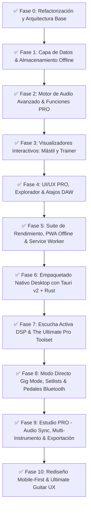

# 🗺️ ROADMAP MAESTRO: TABS & CHORDS PRO (OFFLINE ENGINE)

> **Documento de Arquitectura y Plan de Ejecución Modular**  
> **Arquitecto Orquestador:** Antigravity  
> **Objetivo:** Plataforma Mobile-First (Ultimate Guitar UX) offline para visualización, gestión, reproducción, práctica, estudio DAW y directo de tablaturas.

---

## 🚦 Estado de Ejecución de Fases (100% Verificado con Tests Playwright)

| Fase / Misión | Rol Principal | Estado | Módulos Clave Implementados |
| :--- | :--- | :--- | :--- |
| **Fase 0: Arquitectura Base** | `Arquitecto Orquestador` | **COMPLETADA** | `EventBus.js`, `State.js`, `tokens.css`, `layout.css` |
| **Fase 1: Capa de Datos Offline** | `Agente de Datos` | **COMPLETADA** | `Database.js`, `SoundFontCache.js`, `MetadataParser.js`, `SearchEngine.js` |
| **Fase 2: Motor de Audio PRO** | `Agente de Audio/Core` | **COMPLETADA** | `AudioEngine.js` (Mezclador, Looper A-B, Metrónomo, Tempo Pitch-Neutral) |
| **Fase 3: Visualizadores** | `Agente de Audio/Core + UI/UX` | **COMPLETADA** | `Fretboard.js` (Mástil 24 trastes sincronizado), `SpeedTrainer.js` |
| **Fase 4: Interfaz de Usuario DAW** | `Agente de UI/UX` | **COMPLETADA** | `TransportBar.js`, `LibraryExplorer.js`, `Mixer.js`, `KeyboardShortcuts.js`, `Toast.js` |
| **Fase 5: PWA & Optimización** | `Arquitecto Orquestador` | **COMPLETADA** | `sw.js` (Service Worker), `manifest.json`, Ingesta en lotes (batch cursor) |
| **Fase 6: Tauri v2 Desktop** | `Ingeniero DevOps` | **COMPLETADA** | `src-tauri/Cargo.toml`, `tauri.conf.json`, `main.rs`, `lib.rs` |
| **Fase 7: DSP & Ultimate Toolset** | `Ingeniero DSP + UI/UX` | **COMPLETADA** | `PitchDetector.js`, `ChordEngine.js`, `ChordModal.js`, `ProToolbox.js` |
| **Fase 8: Gig Mode & Setlists** | `Ingeniero de Escenario` | **COMPLETADA** | `GigMode.js`, `SetlistManager.js`, `gig-mode.css`, Soporte Pedales PageTurner |
| **Fase 9: Estudio PRO & Export** | `Ingeniero de Audio & Formatos` | **COMPLETADA** | `AudioSyncEngine.js`, `PianoVisualizer.js`, `DrumKitVisualizer.js`, `Exporter.js` |
| **Fase 10: Rediseño Mobile-First** | `Ingeniero UI/UX Móvil` | **COMPLETADA** | `BottomNav.js`, `HomeView.js`, `ToolsView.js`, `bottom-nav.css`, Ultimate Guitar UX |

---

## 🧪 Validación Automatizada TDD (100% Verde en Viewport Móvil)
- **Playwright E2E**: 6/6 tests móviles pasados en verde sin errores.
- **Consola y Red**: 0 errores de consola (`console.error`), 0 peticiones 404.
- **Axe-core Accesibilidad**: 0 violaciones de accesibilidad WCAG en dispositivos móviles.
